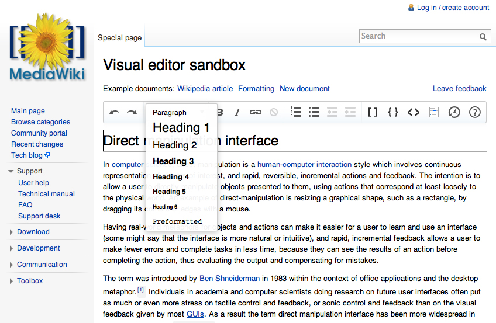
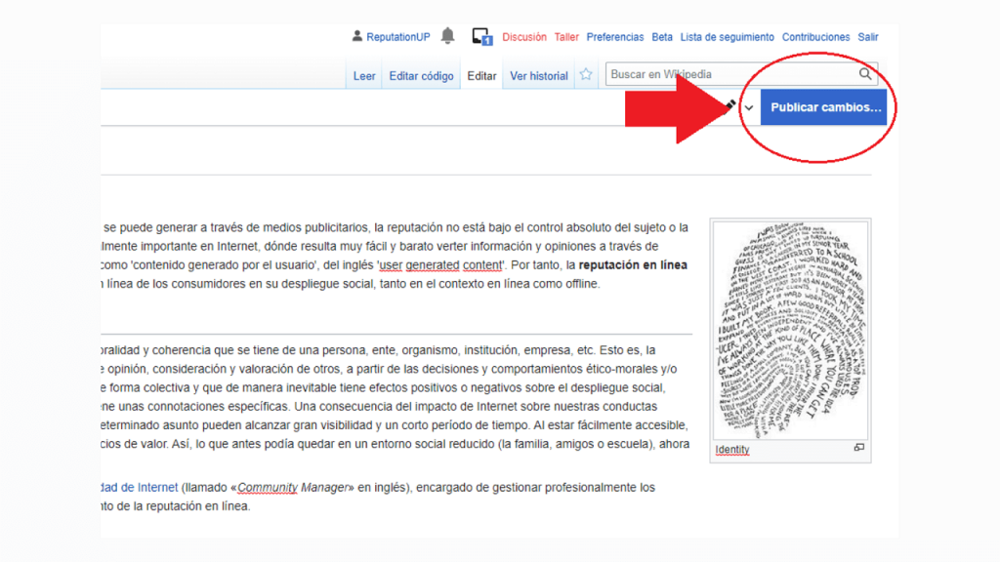

# Manual Wikipedia

## Introducción
Este manual tiene como objetivo guiar paso a paso a los usuarios para registrarse, editar, publicar artículos en Wikipedia y añadir geolocalización. Además, se explica cómo consultar los datos publicados desde herramientas externas.

---

## Registro de Usuario

### Pasos para Crear una Cuenta

1. Ve a la página principal de [Wikipedia](https://www.wikipedia.org).
2. Haz clic en "Crear una cuenta" en la esquina superior derecha.
3. Completa los siguientes campos:
   - **Nombre de usuario**: Escoge un nombre único y representativo.
   - **Contraseña**: Asegúrate de que sea segura.
   - **Correo electrónico** (opcional): Para recuperar tu cuenta o recibir notificaciones.
4. Sigue el proceso de verificación CAPTCHA y haz clic en "Crear cuenta".

### Reglas al Elegir un Nombre de Usuario

- No uses nombres que puedan ser ofensivos.
- Escoge un nombre que no parezca una marca o promoción.
- Asegúrate de que sea fácil de recordar.


---

## Edición de Artículos

### Acceder al Editor

1. Inicia sesión con tu nombre de usuario y contraseña.
2. Ve al artículo que quieres editar o selecciona "Crear un artículo nuevo".
3. Haz clic en "Editar" para abrir el editor.

### Escribir un Artículo

- **Encabezados**: 
  Usa éstos para organizar tu contenido:
  ```
  == Título Nivel 2 ==
  === Título Nivel 3 ===
  ```

- **Listas**:
  - Viñetas:
    ```
    - Elemento 1
    - Elemento 2
    ```
  - Numeradas:
    ```
    1. Paso 1
    2. Paso 2
    ```

- **Enlaces**:
  - Internos:
    ```
    [[Nombre del artículo]]
    ```
  - Externos:
    ```
    [Enlace externo](https://ejemplo.com)
    ```



---

## Publicación de Artículos

1. Una vez termines, haz clic en "Publicar cambios".
2. Escribe un resumen corto sobre lo que editaste.
3. Asegúrate de cumplir con las reglas:
   - Usa fuentes confiables.
   - No incluyas contenido publicitario.
   - Mantén un tono neutral.



---

## Geolocalización en Artículos

### Añadir Coordenadas

1. Ve al editor de texto (modo avanzado).
2. Usa el siguiente formato para agregar coordenadas: 
   ```
   {{Coord|LATITUD|N|LONGITUD|W|display=title}}
   ```
3. Ejemplo:
   ```
   {{Coord|40.4168|N|3.7038|W|display=title}}
   ```
   Esto añade coordenadas para Madrid, España.

---

