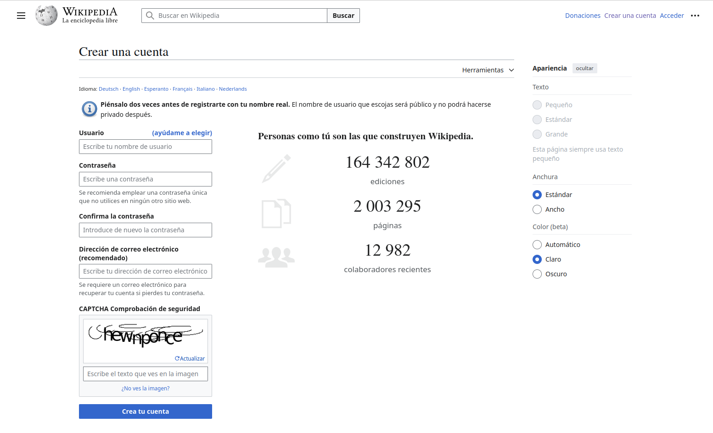

# Manual_Wikipedia

## Introducción
Este manual tiene como objetivo guiar paso a paso a los usuarios para registrarse, editar, publicar artículos en Wikipedia y añadir geolocalización. Además, se explica cómo consultar los datos publicados desde herramientas externas.

---

## Registro de Usuario

### Pasos para Crear una Cuenta

1. Ve a la página principal de [Wikipedia](https://www.wikipedia.org).
2. Haz clic en "Crear una cuenta" en la esquina superior derecha.
3. Completa los siguientes campos:
   - **Nombre de usuario**: Escoge un nombre único y representativo.
   - **Contraseña**: Asegúrate de que sea segura.
   - **Correo electrónico** (opcional): Para recuperar tu cuenta o recibir notificaciones.
4. Sigue el proceso de verificación CAPTCHA y haz clic en "Crear cuenta".

### Reglas al Elegir un Nombre de Usuario

- Evita nombres promocionales o que representen empresas.
- No uses nombres ofensivos o ambiguos.
- Consulta las [Políticas de nombres de usuario](https://en.wikipedia.org/wiki/Wikipedia:Username_policy) para más detalles.



---

## Edición de Artículos

### Cómo Iniciar Sesión y Acceder al Editor
1. Inicia sesión con tu nombre de usuario y contraseña.
2. Busca un artículo existente o selecciona la opción "Crear un artículo".
3. Haz clic en "Editar" en la parte superior del artículo para abrir el editor visual.

### Formato Básico
- **Títulos**: Usa encabezados para estructurar tu artículo. Ejemplo:
  ```markdown
  == Encabezado Nivel 2 ==
  === Encabezado Nivel 3 ===
  ```

- **Párrafos**: Simplemente escribe el texto en líneas separadas.
- **Listas**:
  - Listas numeradas:
    ```markdown
    1. Elemento 1
    2. Elemento 2
    ```
  - Listas con viñetas:
    ```markdown
    - Elemento 1
    - Elemento 2
    ```

- **Enlaces**:
  - Internos:
    ```markdown
    [[Artículo en Wikipedia]]
    ```
  - Externos:
    ```markdown
    [Sitio externo](https://www.example.com)
    ```

### Uso de Plantillas y Referencias
1. Usa plantillas como `{{Infobox}}` para añadir tablas de resumen.
2. Añade referencias con la etiqueta `<ref>`. Ejemplo:
   ```markdown
   Este es un dato referenciado.<ref>Fuente: Libro de Ejemplo, 2025</ref>
   ```

### Ejemplo de Edición:
```markdown
== Historia ==
Wikipedia fue creada en el año 2001.

=== Referencias ===
<references />
```

---

## Publicación de Artículos

### Guardar y Publicar
1. Haz clic en "Publicar cambios" después de completar tu edición.
2. Escribe un resumen breve sobre los cambios realizados.
3. Confirma que cumples con las [Políticas de Wikipedia](https://es.wikipedia.org/wiki/Wikipedia:Pol%C3%ADticas).

### Políticas Principales
- **Verificabilidad**: Incluye fuentes confiables.
- **Neutralidad**: Evita opiniones personales.
- **Sin promoción**: Los artículos no deben parecer publicidad.

---

## Geolocalización en Artículos

### Cómo Añadir Coordenadas
1. Accede al editor de texto (no el visual).
2. Usa la plantilla `{{Coord}}`. Ejemplo:
   ```markdown
   {{Coord|37.7749|N|122.4194|W|type:landmark|display=title}}
   ```
   - `37.7749|N`: Latitud en grados.
   - `122.4194|W`: Longitud en grados.
   - `type`: Tipo de lugar (ejemplo: `city`, `landmark`).
   - `display=title`: Muestra las coordenadas en la cabecera del artículo.

### Ejemplo:
```markdown
{{Coord|40.4168|N|3.7038|W|type:city|display=title}}
```
Esto añade coordenadas para Madrid, España.

---

## Uso Externo

### API de Wikipedia
1. Accede a la API de Wikipedia desde [MediaWiki API](https://www.mediawiki.org/wiki/API:Main_page).
2. Ejemplo de consulta para obtener datos geolocalizados:
   ```bash
   https://en.wikipedia.org/w/api.php?action=query&prop=coordinates&titles=Madrid&format=json
   ```
3. Respuesta JSON típica:
   ```json
   {
       "query": {
           "pages": {
               "12345": {
                   "title": "Madrid",
                   "coordinates": [
                       {
                           "lat": 40.4168,
                           "lon": -3.7038
                       }
                   ]
               }
           }
       }
   }
   ```

---


